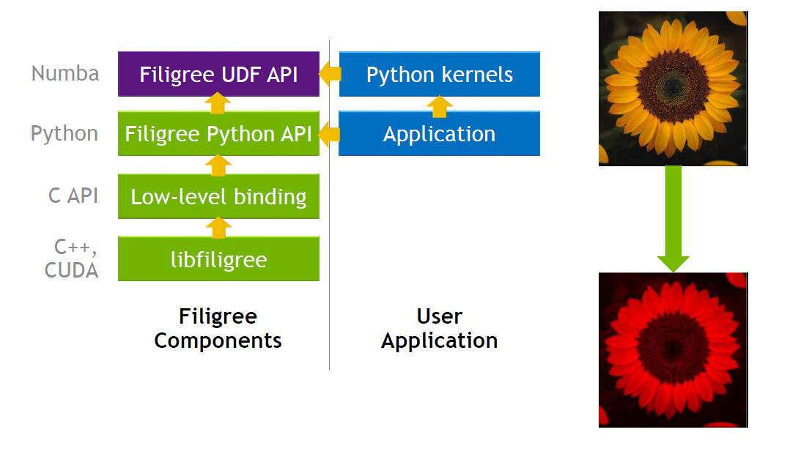

# Enabling Python User-Defined Functions in Accelerated Applications with Numba

* Author: Graham Markall, NVIDIA
* Contact: [gmarkall@nvidia.com](mailto:gmarkall@nvidia.com) /
  [@gmarkall](https://twitter.com/gmarkall)
* Last updated: 22 March 2022




## What is this?

This repository contains code and examples related to the [GTC
2022](https://www.nvidia.com/gtc/) talk:

* [Enabling Python User-Defined Functions in Accelerated Applications with
  Numba](https://www.nvidia.com/gtc/session-catalog/?tab.scheduledorondemand=1583520458947001NJiE#/session/16339878397050012ADx)

The components of this repo are:

- The Filigree C++ library (mostly in [`src`](src) and [`include`](include)).
  Filigree is a very simple image processing library written for the purpose of
  demonstrating the implementation of support for Python UDFs in a CUDA
  application with Numba. It uses ImageMagick for file I/O and also ImageMagick
  data structures for the images in-memory. Some simple image transformation
  kernels are included.
- An very simple C++ application using the Filigree library (`greyscaler`). This
  application reads an image, uses Filigree to convert it to greyscale, and
  writes it out again.
- The Filigree Python library / API. This provides access to Filigree's kernels
  and operations from Python, but standalone it is not possible to write
  transformation kernels in Python.
- A Numba extension used by Filigree's Python API to enable users to write image
  transformation functions that run on the GPU in Python, without the user
  needing any involvment in / experience with CUDA.
- PTX examples from Numba and NVCC for comparison of the generated code, as
  referenced in the talk.
- An example notebook demonstrating the use of the Filigree Numba extension.


## Requirements

The code and examples in this repository are aimed at being usable on a recent
Linux distribution. If you have any difficulty in setting up the environment,
building the code, running the example, or in understanding the Numba extension,
please [open an
issue](https://github.com/gmarkall/numba-accelerated-udfs/issues).


## Environment setup

Install [Mambaforge](https://github.com/conda-forge/miniforge) and create an
environment with:

```
mamba create -n filigree numba jupyter libpng cmake glib ninja pytest \
                         giflib jbig lcms2 lerc libdeflate libtiff libwebp openjpeg
```

Activate the environment with:

```
conda activate filigree
```

## Building

Due the requirement for a specific version of ImageMagick (6, which is used as
it has a simpler image data structure than 7), a couple of dependencies are
vendored into this repository. Dependencies are installed into the Conda
environment once built.


First, to build ImageMagick, run:

```
mkdir im_build
cd im_build
PKG_CONFIG_PATH=$PKG_CONFIG_PATH:$CONDA_PREFIX/lib/pkgconfig ../vendor/ImageMagick6/configure --prefix=$CONDA_PREFIX
make -j12
make install
cd ..
```

A fork of Pillow is required, which supports decoding the BRGA16 format used in
ImageMagick 6 for the image data (although we don't process images with Pillow,
it provides a convenient way to view images in Jupyter notebooks). Build the
Pillow fork with:

```
cd vendor/Pillow
python setup.py develop
cd ../..
```

To build the Filigree C++ library, use:

```
mkdir build
cd build
PKG_CONFIG_PATH=$PKG_CONFIG_PATH:$CONDA_PREFIX/lib/pkgconfig cmake .. -G Ninja -DCMAKE_INSTALL_PREFIX=$CONDA_PREFIX
ninja
ninja install
cd ..
```

To build the Python C extension for Filigree and to make the `filigree` module
available in the Python environment, run:

```
PKG_CONFIG_PATH=$PKG_CONFIG_PATH:$CONDA_PREFIX/lib/pkgconfig python setup.py develop
```


## Testing

To run the Python API tests, run:

```
pytest filigree
```

These are extremely rudimentary, but will detect if there has been a fundamental
problem with the build or installation of the libraries.

## Running the example C++ application

This step is uninteresting to most users, as it only demonstrates the use of the
library in a pure C++ context. To use it, run

```
./build/bin/greyscaler <input image name> <output image name>
```

e.g.

```
./build/bin/greyscaler filigree/tests/images/sunflower.png grey-sunflower.png
```


## Running the example notebook

The example notebook contains a demonstration of all the UDF functionality
described in the presentation. It can be opened with:

```
jupyter notebook "notebooks/Filigree Demo.ipynb"
```


## PTX comparison

PTX generated by NVCC and Numba for equivalent functions for inspection (as
mentioned in the talk) is located in the [`ptx_comparison`](ptx_comparison)
subdirectory. 


## Resources / help

* [Slides for this talk](slides.pdf): The final slide contains links to further
  resources and places to reach out for help.
* [Issue tracker](https://github.com/gmarkall/numba-accelerated-udfs/issues):
  Please open an issue if you have any difficulty in building or running the
  examples in this repository.
